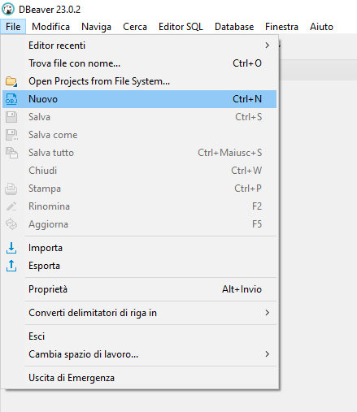

# Easyfatt - Python

Questo pacchetto fornisce diversi strumenti per semplificare lo sviluppo di automazioni in **Python** per l'applicativo gestionale "[**Danea Easyfatt**](https://www.danea.it/software/easyfatt/)".

## Funzioni

- Lettura file `.DefXml` esportati da Easyfatt (_ordini cliente, vendite banco, preventivi, ecc.._)
- **Download driver** firebird (necessario per la connessione al DB di Easyfatt)
- Connessione al **database** di Easyfatt

## Utilizzo

### File `.DefXml`

Il modulo `easyfatt_db_connector.xml` espone la classe `EasyfattXML` e la funzione `read_xml` (una funzione "utility" che restituisce un'istanza di `EasyfattXML`).

Sia i metodi `EasyfattXML.from_xml*()` che la funzione `read_xml()` accettano il parametro `convert_types` (di default impostato a `True`) che permette di convertire i valori dei tag in tipi Python nativi (es. `int`, `float`, `bool`, ecc..). Se disabilitato i valori dei tag saranno sempre stringhe o `None`.

#### Esempio

In questo esempio lo script leggerà l'esportazione di una serie di ordini cliente e stamperà a schermo l'indirizzo di spedizione di ogni documento:

```python
from pathlib import Path
from easyfatt_db_connector.xml import read_xml

xml_file = Path("OrdiniCliente.DefXml").expanduser()

# Questa istruzione...
xml_object = read_xml(xml_file, convert_types=True)

# ... si può scrivere anche così
xml_object = EasyfattXML.from_xml_string(xml_file.read_bytes(), convert_types=True)

for doc in xml_object.documents:
    print(f"Document n°{doc.number}{doc.numbering} will be shipped at '{doc.delivery.address}'")
```

L'output sarà il seguente:

```plaintext
Document n°1 will be shipped at ''
Document n°2 will be shipped at ''
Document n°3 will be shipped at ''
Document n°1/A will be shipped at ''
Document n°2/A will be shipped at ''
Document n°4 will be shipped at ''
Document n°5 will be shipped at ''
Document n°6 will be shipped at 'Via Facciolati, 546'
Document n°3/A will be shipped at 'Via Catania, sn'
Document n°7 will be shipped at ''
Document n°8 will be shipped at 'Via Rodolfo Manganaro'
Document n°9 will be shipped at 'Via Enrico Berlinguer,75'
Document n°10 will be shipped at ''
Document n°11 will be shipped at 'Via C. Colombo, 632'
Document n°12 will be shipped at ''
Document n°13 will be shipped at ''
Document n°1/B will be shipped at ''
Document n°14 will be shipped at 'Via G. Di Vittorio, 56'
Document n°15 will be shipped at 'Via Cavour, 152'
Document n°16 will be shipped at 'Via N.S. degli Angeli, 28'
```

### Database: download driver Firebird (_prerequisito_)

Per connettersi al DB di Easyfatt è necessario scaricare il driver Firebird `Firebird-{version}-embed.zip` (versione [2.5.8](https://github.com/FirebirdSQL/firebird/releases/tag/R2_5_8) o [2.5.9](https://github.com/FirebirdSQL/firebird/releases/tag/R2_5_9)) e specificarne il percorso.

```python
from easyfatt_db_connector.core.connection import EasyfattFDB

database = EasyfattFDB(archive_path=database_path, firebird_path="./firebird-driver")
```

Questa procedura può essere automatizzata impostando il parametro `download_firebird` a `True` (di default è `False`). E' possibile controllare il percorso di download del driver tramite il parametro `firebird_path` (di default `~/.cache/firebird-driver/`).

```python
from easyfatt_db_connector import EasyfattFDB

database = EasyfattFDB(archive_path=database_path, download_firebird=True)
```

> **ATTENZIONE**
>
> L'opzione `download_firebird` è impostata di default a `False` per evitare che il programma effettui download in ambienti di Produzione.
>
> Se questo è il comportamento desiderato impostare il parametro a `True`.

### Database: connessione e query

In fase di connessione al DB l'istanza `EasyfattFDB` provvederà a fare una copia del database in una cartella temporanea (ed alla sua eliminazione ad operazioni terminate) così da permettere l'utilizzo anche con Easyfatt in esecuzione.

```python
from easyfatt_db_connector.core.connection import EasyfattFDB

database = EasyfattFDB(archive_path=database_path, download_firebird=True)

with database.connect() as connection:
    customers = [dict(item) for item in connection.cursor().execute('''
        SELECT anag."CodAnagr", ANAG."Nome", ANAG."Indirizzo", ANAG."Cap", ANAG."Citta", ANAG."Prov", ANAG."Regione", IIF(naz."NomeNazionePrint" IS NULL, 'Italia', naz."NomeNazionePrint") AS Nazione
        FROM "TAnagrafica" AS anag
        LEFT JOIN "TNazioni" naz ON ANAG."Nazione" = naz."NomeNazione";
    ''').fetchallmap()]

    print(customers)
```

## Development

### Note per Windows

#### Build con PyInstaller

In fase di build con PyInstaller (sia in modalità `--onefile` che `--onedir`) è necessario tenere in considerazione le seguenti note:

- **Non usare mai UPX** se disponibile (a causa di un bug che porta la DLL `fbclient.dll` a crashare in modo randomico impedendo la connessione al DB). Se possibile includere sempre `--noupx` tra gli argomenti di build.
- Aggiungere `--collect-all sqlalchemy_firebird` tra gli argomenti di build per evitare che PyInstaller non includa il modulo `fdb` e `firebird-driver` (che non vengono rilevato automaticamente).

### Python

```shell
poetry config virtualenvs.prefer-active-python true
poetry env use $(pyenv which python)
```

### Database

1. Installare [**Firebird SQL** 2.5.9](https://firebirdsql.org/en/firebird-2-5/) (selezionare la versione "_64-bit Classic, Superclassic & Superserver_")
2. Assicurarsi di selezionare "**Run as service**"

Per controllare l'avvenuta installazione:

1. Aprire un terminale Powershell nella cartella di installzione (nel mio caso `C:\Program Files\Firebird\Firebird_2_5`)
2. Lanciare il comando `cd bin`
3. Lanciare il comando `./isql.exe "{PERCORSO_DATABASE}\{NOME_DATABASE}.eft" -u sysdba -p masterkey`
4. Ora è possibile eseguire query SQL (assicurandosi che finiscano SEMPRE con `;`)
     

### Database tool

1. Installare ed aprire [**DBeaver**](https://dbeaver.io/):

     

2. Cliccare su "File > Nuovo":

     

3. Cliccare su "DBeaver > Connessione a Database" e cliccare "Avanti":

     

4. Nel campo di ricerca scrivere "Firebird", selezionare il primo risultato e cliccare "Avanti":

   

5. Compilare i dati richiesti:
   - **Generale**:
     - Host: `localhost` (default)
     - Porta: `3050` (default)
     - Percorso: adeguare alla posizione del database nel proprio sistema
   - **Autenticazione**:
     - Nome utente: `SYSDBA` (default)
     - Password: `masterkey`

     

6. Terminare la configurazione del driver cliccando su "Fine"

## Alcune note

- Assicurarsi che sia visibile almeno la finestra "Navigatore Database":

    
